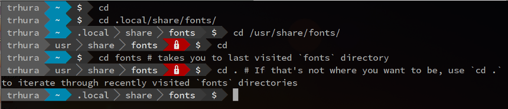

## About

`went` is a small `go` program, that let you go to recently visited
directories by its basename without using its full path, when wrapped
around the shell bulitin `cd`.

Although there are similar and more feature-savy tools, like
[autojump] (https://github.com/joelthelion/autojump), `went` differs
from other tools in its simplicity and unobtrusiveness.

Being a simple wrapper around `cd`, there is no flag/option/setting to
remember, and `want` tries not to interfere with normal `cd` usages.
Actually, most of the time, you wouldn't even notice it is there. It
just silenty keep track of where you have been and let's you revisit
those places quickly.

## Usage



Very simple. Just use `cd dirname` to go to last visited directory
with that name. If there is more than one visited path with the same
name, use `cd .` to iterate through those paths.

A few other useful shortcuts, like using `cd ..[...]` to go up parent
directories, are also available.

## Installation

Assuming you have installed golang, and configured `$GOPATH`.

+ Get the sources from github.
```sh
go get github.com/trhura/went
```

+ You may need to compile the binary.
```sh
cd $GOPATH/src/github.com/trhura/went && go build went.go
# Or this, depending upon your system
cd /usr/lib/go/src/pkg/github.com/trhura/went && go build went.go
```

+ Wrap the shell builtin shell `cd`. (Add this in your `.bashrc` or `.zshrc`)
```bash
function went {
        builtin cd $($GOPATH/src/github.com/trhura/went/went $@)
}

alias cd=went
```

+ Completions (Put `cd_bash_completion.sh` in your `/etc/bash_completion.d` as `cd`)
```bash
cp cd_bash_completion.sh /etc/bash_completion.d/cd
```
